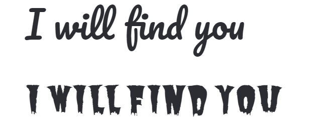

<!--StartFragment-->

The style of everything is very important to us. How things work visually can make us like, dislike, purchase, watch, read or not read things. What we choose to interact with is also a signifier to others that we identify with it. This is the same for magazines. We often choose a magazine to read based on how it looks to us, and subconsciously or consciously - how it looks to others. This is alongside the characteristics that the magazine has that we as the audience feel that we relate to. The magazine’s typography acts as a subtle means of communication. (According to N. Paudyal on Engadget.com) 

Typography has a big impact, bigger than we may initially think. The way fonts work to stay in line with the branding of said magazine/brand is highly important. If the typography and brand seemed to be misaligned, it would throw the design of the magazine off, be less aesthetically pleasing and thus, a consequential effect could affect the sales, which would gradually affect the brand in the long term. The typeface a brand uses conveys to the reader what kind of brand they are.

For example a brand such as Vogue, who brand themself as well established and upmarket, they have chosen a high contrast serif typeface, high contrast conveying fragility or that it is delicate (expensive). This accompanied with the Sans Serif font makes it appear high-end because Serif nods to the company having history, heritage, or class. Also, their font being extended shows to the audience that they can afford to take up space, which could reflect Vogue’s position in the market. This is obviously very in line with the brand of Vogue, as they have been around since 1892 (founded by Conde Nast) and are very well known and respected - and arguably one of the first brands consumers think of if you say ‘fashion magazine’. According to Amy Watson, Jul 1, 2021, for ‘Statista’, ‘Vogue reached around 2.7 million individuals between April 2019 and March 2020 in the United Kingdom’. This shows the kind of hold they have over their given market, so the typeface they use would need to reflect this - and draw customers in and keep their attention. 

Aside from being important for brand cohesion, a typeface/font also can portray an underlying message, for example, the sentence ‘I will find you’ can come across very differently depending on the way the letters appear. To show this - see below:

See, the above statements are the same sentence but can be read completely differently, depending on the font. One seems friendly and supportive, while the other seems threatening and disconcerting. The drastic change here shows us just how influential fonts can be. So, if everyone tries to tell you that it doesn’t matter which font you use, don’t listen, it definitely matters.

<!--EndFragment-->