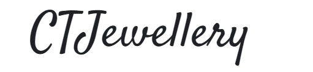
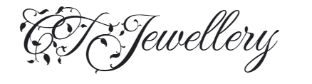

<!--StartFragment-->

Starting a brand? You want to choose a type of typography that would suit it? It can be difficult to know what to go for. Here are some of the basics. First you will need to decide what you desired demographic is. For example, let’s say you are starting a jewellery business. Is it high-end? Or more accessible to all - maybe it’s for the younger generation? Maybe it has a more bohemian aesthetic. Once you’ve decided who you are marketing to, its time to work on branding. 

Branding is paramount for a business to do well in my eyes, a company can provide the best product or service, but if the branding is not up to par, people will be less likely to look at/use your brand. Kristopher Jones, Forbes Councils Member agrees by writing ‘There’s a huge amount of competition today, so businesses need to go the extra mile of ensuring they stand out in a crowd. To do this, you should invest in creating a strong brand that will get and keep people’s attention. With the right branding, you have the chance to get some control over how people perceive your business, so you don’t want to overlook this’. (This quote was written on the 24th of March, 2021). 

Let’s start with the variations you could choose. If my jewellery brand was called ‘CTJewellery’ for example, if it was a more bohemian brand, you may want it to be a more friendly style, perhaps also more modern, so it's likely you will want a Sans Serif font, as they tend to convey a more relaxed, friendly feel. For example, see below: 

This font seems non threatening. With the right styling, graphics and colour choices I could perhaps see this as a young person’s fun jewellery brand. It is also a low contrast font meaning that it is easily readable so it seems accessible and suitable for a wide range of people, which for a hypothetical brand such as this one, would be important as they want to appear stylish but also friendly and fun.

On the flip side, for a brand that is trying to look more highbrow and upmarket though, fonts that connote sophistication would perhaps be better. This would probably look like a Serif font with mid to low weight, with high contrast. The use of a high contrast font with low weight would seem high-class as it denotes fragility, and being delicate while Serif makes it seem as if the brand has history, and class. The delicate nature of this may be saying that your given brand doesn’t need to be big and bold to be noticed because it’s already well-established in its market segment and among the right people, (your demographic). This can be backed up by Max Freedman, Business News Daily contributing writer (26th of Aug 2020), who wrote ‘demographic targeting is important for determining the group of people who best fit your vision of the ideal customer’. 

 Although giving this impression when just starting out may be difficult, it’s best to stick with it, as it may be better to have a few high paying customers - than lowering your price/changing the logo to appeal to a wide range of people. This is because your demographic is set - it’s quite hard to change it. Freedman continued by saying ‘demographics can – and should – inform your marketing strategy from the bottom up’.

If we are trying to appeal to the high-end jewellery brands, we want to appear like we come from old money from the start! Haha, the font that you initially choose can help you do this.

Below is an example:

In the image above, it would work for a high-end brand as there is greater contrast, it is serif, and it is light. As I said previously above, all of this put together gives this ‘brand’ a very luxurious appeal. 

This shows how important it is to correctly brand according to your given demographic, as the two hypothetical brands above demonstrate that this is crucial to how the brand appears to consumers. Once you pick your brand and demographic - all you have left to do is pick a suitable typeface - and boom! You’re well on your way to creating a brand that you love!

<!--EndFragment-->