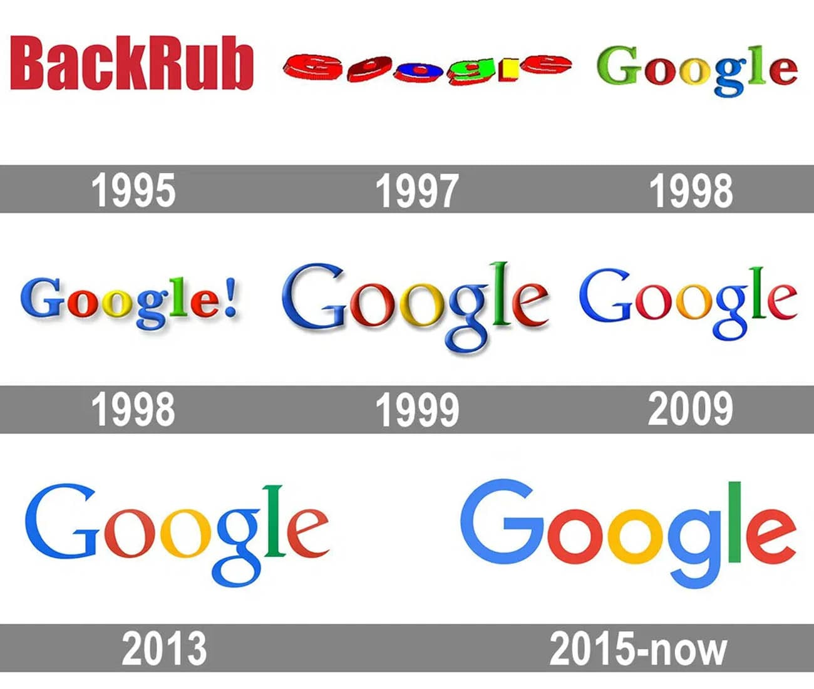

A brand's logo is an integral part of it’s whole presence. How they change can reflect the brand’s progression and direction. For example, the Google logo has had many variations over the years. For example, the first in 1996 was originally for ‘Backrub’, which later became ‘google’. This was due to a misspelling of ‘googol’ which in short means the biggest number ever, an infinite number (10 to the 10th power). After this, in 1997, this was the first ‘google logo as we know it'. 

A brand's logo is an integral part of it’s whole presence. How they change can reflect the brand’s progression and direction. For example, the Google logo has had many variations over the years. For example, the first in 1996 was originally for ‘Backrub’, which later became ‘google’. This was due to a misspelling of ‘googol’ which in short means the biggest number ever, an infinite number (10 to the 10th power). After this, in 1997, this was the first ‘google logo as we know it. ’ 

Clearly, this version of the logo looks very primitive today, compared to the one we’re used to. The font chosen doesn’t seem to match the branding today and it looks like less thought was given to how readable it is to the consumer. Although, it is still in Sans Serif, which we are used to. This gives the logo a ‘straight to the point’ appearance, like it is more for utility, and that is accessible for all. If the writing was Serif, I think it would make the logo look more exclusive. Obviously exclusivity can be a good thing, however, in this instance I’m sure Google would want it to look accessible for all as it was a new search engine so, they would want more people to use it. 

Then later, in 1998, they began updating the style - to look more inline with what we’re  used to today. The colour scheme looks far more contemporary and much more visually appealing. This version, though, looks arguably more old fashioned due to the style chosen and the fact that they used a Serif version in this instance.

Next, let's go to 1999. This is when, in my opinion, Google really started to ‘segment’’ their own design. They had a more consistent style, colour scheme and settled on a style and font. They also dropped the exclamation mark which they had trialled in 1998 this was dropped by Ruth Redar. Andrew Griffin for the independent in 2019, wrote ‘That shouting logo would be the last very different one that the site would have. Until today’s redesign, the site stuck by its formula: two blue letters, two red and one yellow and one green, all in an entirely unobjectionable serif font.

The company would gradually change that look, moving letters around, softening the colours and getting rid of shadow, but the concept remained the same until 2015’.

The google font remained like this (apart from minor changes, like the removing of shadows to get rid of the embossed texture) in 2013. 

Then in 2015, till today we gave the most modern version. This is done with Product Sans with a lower contrast which shows that it’s for everyone, as it feels less pretentious, more friendly/youthful and overall, cleaner and more uniform. ‘It signifies a smart set of fonts that are user-friendly and more perceptive than all the other previous logos’ - Logo Design, Branding, Case Study’. It’s also playful, which shows that Google are telling the consumer that they are suitable for all types of users.

