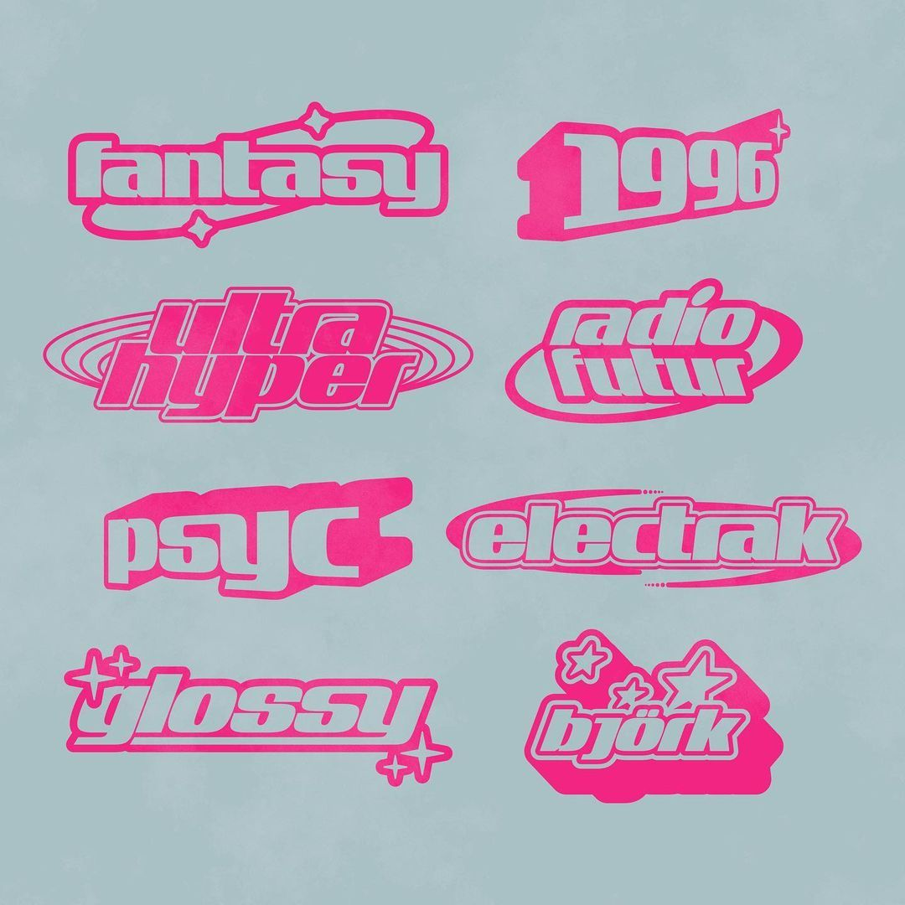
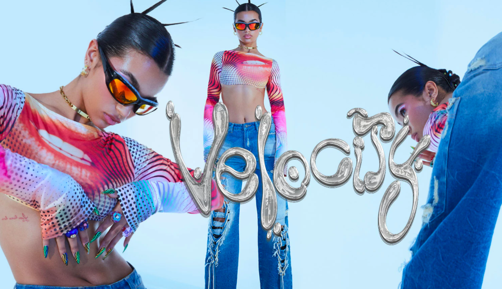

The Y2K (Year 2000) aesthetic is very popular at the moment, both in fashion and design. For many (including myself) it's like a recall to their childhood, and a way to be playful and nostalgic while keeping in style. This is also the same for when it comes to typography. 

Here is an example of Y2K typography 

 As you can see, Y2K typography is very futuristic and modern because Y2K originated when there was a new sense of optimism because of new technology and the new millennium. With computers being used the fonts became bolder and higher contrast. As well as them being stylised they also have a sort of bold and robust appearance to them because it reflects the digitised nature of how society was becoming in 2000.

Today, companies like Urban Outfitters, Missguided and Jaded Ldn all have used a Y2K fluid like textures as these companies brand themselves as being stylish and up-to-date with trends, and as Y2K and Y2K typography has made a massive come back, it is no surprise brands such as these have jumped on a chance to cash in. 

Here is a very recent screenshot from the Jaded London website showing how popular Y2K fashion and typefaces are today. As I've said before, this acts as a re-call back to people's childhoods. Also many 2000s babies (like myself) are coming into adulthood, so this aesthetic is like an integration of inner child and adulthood for this new generation of adults. Also within fashion we almost always see a recurrence of times before.

Y2K for women is also hyper-feminine more-often-than-not, so in this way, the Y2K style is helpful for women who want reclaim their femininity. Because often women have been made fun of for being girly, this could act as a way of standing up against that and saying that it's good to be feminine and like stereotypically girly things. That's why often Y2K typography is fun, bright, and feminine looking. 

Y2K can also be seen as quite anti-establishment because it is youthful and playful which goes against the idea of growing up and traditionally getting a corporate job. It seems to leave greater space for creativity and experimentation. This could be why we could be seeing the creative industries, especially, for example social media growing as a legitimate job sector. Because of all of this growth in creativity – we have also seen a change in typeface use. Where more Y2K ‘care-free’, playful fonts may have been frowned upon if used by big companies before, now there is actually a push for it. This is because it will subconsciously tell a customer that they are socially aware of this style change. Not only that, but at a push – it may signal to the consumer that the brand’s ideal’s match up with theirs – even if this is not exactly true. For an example, Jaded London typically brand themselves as for girls who appreciate the Y2K aesthetic – the kind of care-free tear away style. These girls as a stereotype, will often care about social issues, like ethical sourced clothing. While Jaded London seem like they would fit this ideal – they actually use sweatshops.

This is interesting, as it highlights the important of a brand’s presence and look using graphics like typography and imaging to give a specific group of people a certain impression.