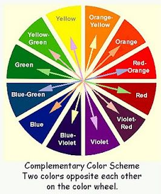

Now, we've spoken a lot about the importance of choosing you typography to convey a specific message, but what about the colour? You're probably thinking that must be important to right? You would be correct. Colours help convey meaning and emotion so if your typography doesn't match up to the aesthetic and feeling you/your company is trying to achieve, it will give the wrong message. 'Most of that judgment is based on colour alone'. - Ritusharma on 13th September 2021, for Inkbot Design.

For example, if you want to convey trust - blue is always good and gives the viewer/consumer a sense of calm. This can also link to water and the sky - like how often we associate these two things with calm and serenity. Companies that use this include Dell, Walmart, Twitter and Oral B to name a few. This blue also has a feeling of  linking to technology. So, it is important that the typography goes with the brand and colour as the whole aesthetic would be thrown off. Often companies will go for black or white tones as they are easy to match to the colour scheme. If not that then they will use complimentary colours.

'They are the colours chosen to attract the most attention. You create your moods and bring forth emotions with them...You might even consider using two or three complementary colours as a combined, visually appealing website background colour instead of having a plain white background' - This is again from Inkbot. Furthermore, it's very important that the colour of your typography matches your desired demographic. For example, Barbie uses bright pinks, soft yellows and soft greens. The main 'Barbie' typeface is the bright pink section which makes sense for both the brand and the audience as pink is of course, generally associated with girls and their target audience was originally meant for 9 to 12 years old. However that later lessened to 3 to 6, however the changing of demographics is a topic for another blog post I think. My main point is that that both the typeface and colour of it matches that of those who are buying them. Barbie seems fun, playful and youth like which of course lines up with their audience. (Numbers from Los Angeles Times and Doctor Rebecca Hans). 

When choosing colour schemes for your typography there are some good software out there that can give a helping hand, so that your brand's logo is cohesive. One of those such softwares in Adobe Colour. Aside from this, if you didn't feel qualified to do it yourself (which I understand because technology can sometimes seem daunting if you're new to it), you can hire a graphic designer to do it for you! Another thing to bear in mind is that it can be really helpful (and necessary!) to link you logo typography to your colour scheme of your website  if you have one. That way everything links nicely and makes sense visually - which is important - especially if you are trying to pull in prospective customers! Colour palettes are your friend!

Anyway, I hope you found this a least some what helpful, have fun choosing your typeface and brand colour schemes!

