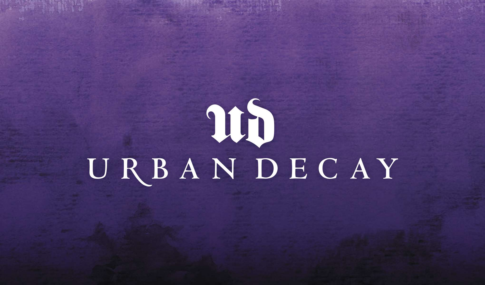
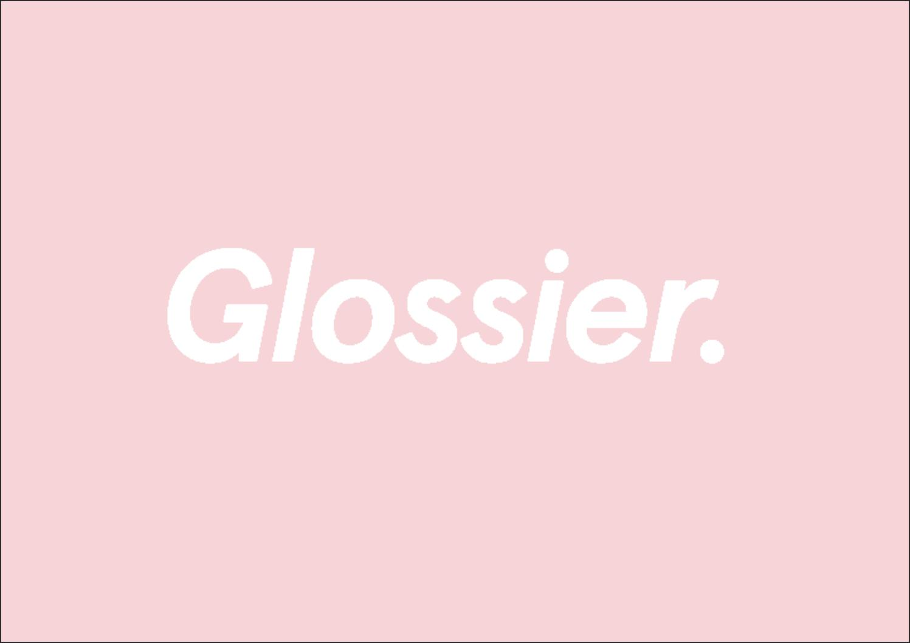

By now, we have discussed why typography is important for all brands in general, now since I am interested in makeup I thought we could take a deeper look into makeup typography for branding.

For example, let's compare a few. First we’ll look at Urban Decay. They have branded as ‘beauty with an edge’. So seemingly for a more alternative audience. Also the name it’s self - Urban Decay is dystopian and gothic and they have matched with their chosen typography choice. Their choice of typography is very similar to Frette Frakur font. This is a high contrast, dramatic serif font, which as I said denotes a gothic aesthetic. As well as this, it also seems to be luxurious., fragile and precious. With the use of serif it gives a tone of holding heritage and also coming from old money for example. In brand terms this is clever as it subtly or subconsciously implies that they have had a good hold on their given market. Also showing that they are well established. 

Next, let's look at another popular one, Glossier. Glossier is quite different in their approach. their brand seems fresh, youthful, bright and clean. and their chosen typography reflects this. They use font Aperçu. This is a Sans Serif font which denotes modernity and new. Also the type-face is quite thick and low contrast which feels straight-forward and simple. Giving the impression that simplicity is better and that the brand do not have to try too hard. It also looks friendly and non threatening. However, they have also used a slight italicisation, which says to the consumer that they are different. The minimalist nature of their brand also coincides with their actual products, because they sell products which a very light and fresh for those who like their makeup very natural looking.

Now, let's move on to think about the way the brand NARS present themselves. I find their branding and typography quite interesting because their font style is very thin and Sans Serif. Again, similar to Glossier, the have a very minimal aesthetic. Quite understated. As if they don't need to have grand, large fonts to attract attention as they are already comfortable with their current standing within their sector. Being light and thin. Also the letters are condensed, overlapping and crossing over which gives it a quite modern, abstract view. This again, matches the products well, as the NARS products look sleek and matte which makes the brand look expensive and forward facing.

Who would have thought that the shape and look and letters would have such an effect on what products we decide to put on our faces.

